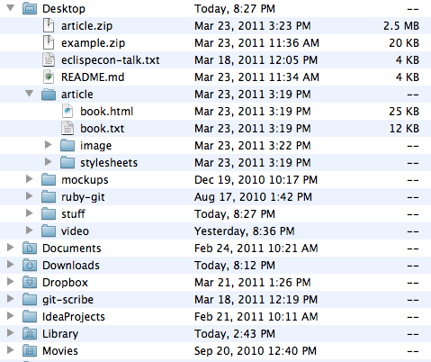
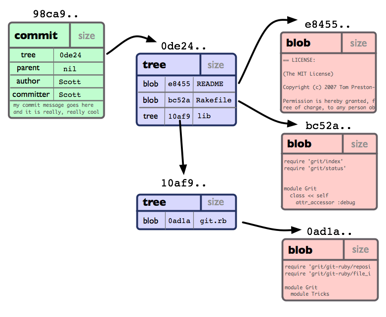
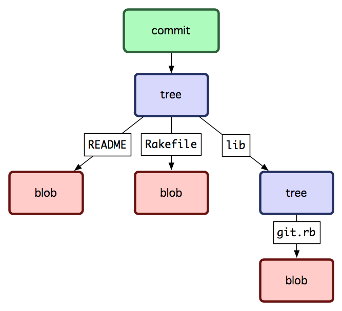

!SLIDE subsec

# PREFACE #

## How Git Works ##

!SLIDE

## It's all about the trees, baby ##

!SLIDE center blockimg

!SLIDE center title

# TREE IS #
## files and subtrees ##

!SLIDE title

# EXAMPLE #

!SLIDE bigcode

    $ tree
    .
    ├── README
    ├── Rakefile
    └── lib
        └── git.rb

        1 directory, 3 files

!SLIDE center

!SLIDE center

!SLIDE center

!SLIDE center

