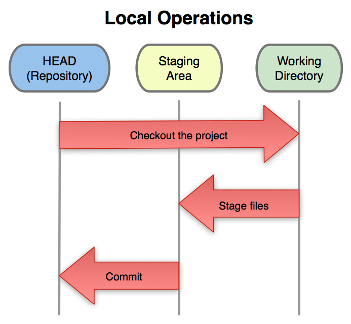
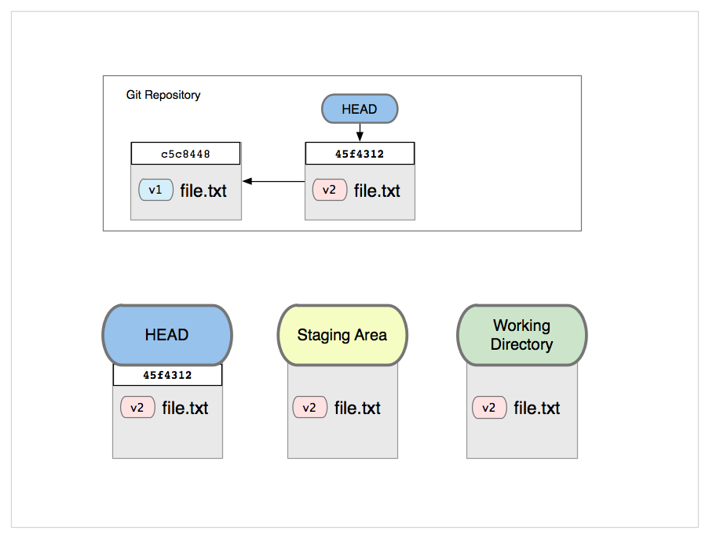
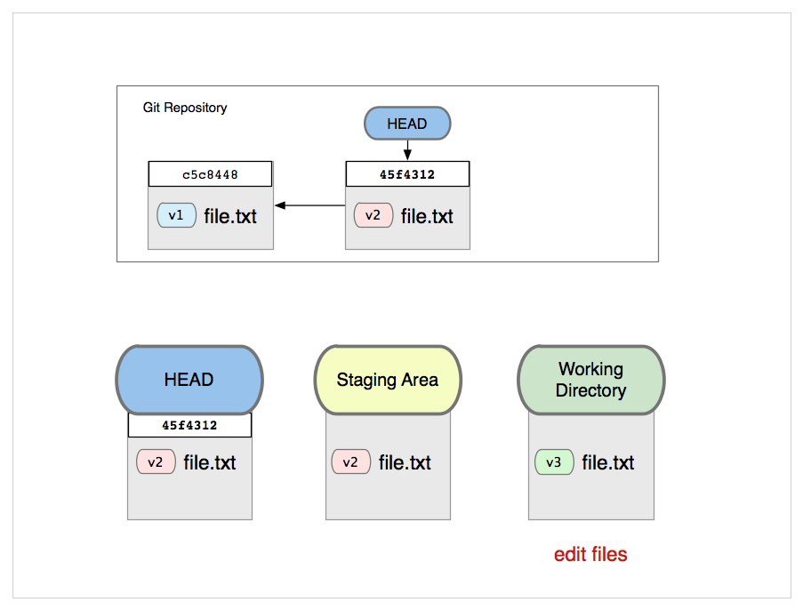
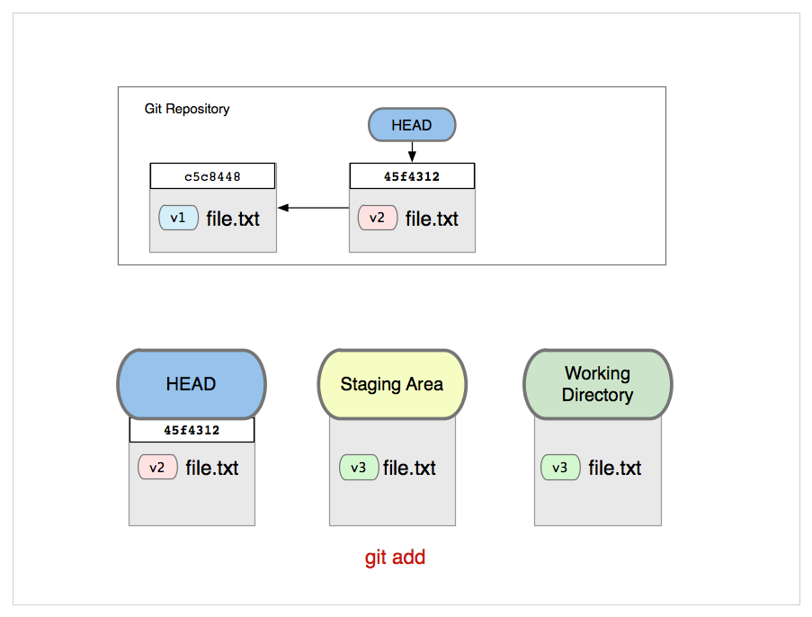
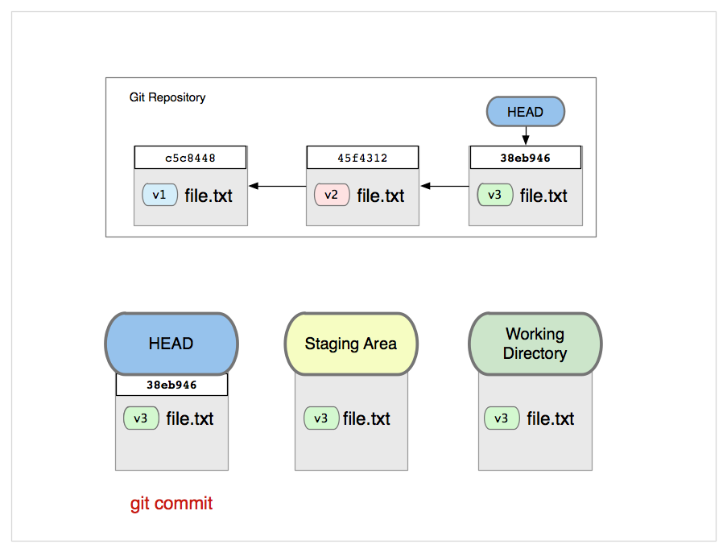
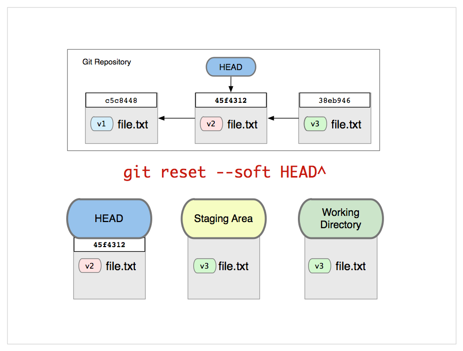
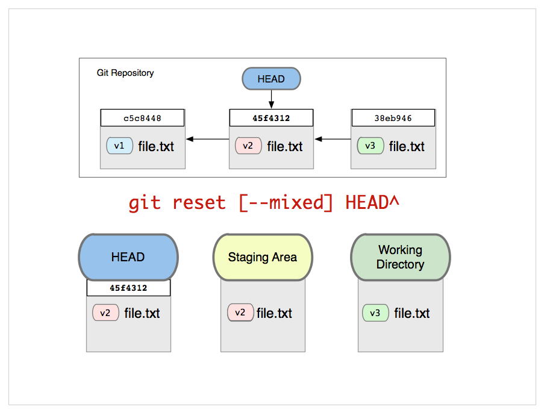

!SLIDE center subsection

# The Trees #

!SLIDE center

# HEAD, index, work tree #

!SLIDE center

!SLIDE

# Environment Variables #

!SLIDE 

## moving around your git pieces ##

!SLIDE bullets incremental

* git directory
* index file
* working directory

!SLIDE code

# GIT_DIR #

!SLIDE commandline incremental

	$ mv .git /opt/repo.git

	$ git --git-dir=/opt/repo.git log

	$ export GIT_DIR=/opt/repo.git
	$ git log

!SLIDE code

# GIT_INDEX_FILE #

!SLIDE commandline incremental

	$ git status -s
	 M README
	 M kidgloves.rb
	
	$ git add kidgloves.rb 
	
	$ git status -s
	 M README
	S  kidgloves.rb

!SLIDE commandline incremental 

	$ export GIT_INDEX_FILE=/tmp/index
	$ git read-tree HEAD
	$ git add README 
	
	$ git status -s
	S  README
	 M kidgloves.rb

!SLIDE commandline incremental 

	$ unset GIT_INDEX_FILE
	
	$ git status -s
	 M README
	S  kidgloves.rb
	
	$ export GIT_INDEX_FILE=/tmp/index
	
	$ git status -s
	S  README
	 M kidgloves.rb

!SLIDE code

# GIT_WORK_TREE #

!SLIDE commandline incremental

	$ git status -s
	 M README
	S  kidgloves.rb

	$ export GIT_DIR=$(pwd)/.git
	$ export GIT_WORK_TREE=$(pwd)

	$ cd /tmp
	$ git status -s
	 M README
	S  kidgloves.rb

!SLIDE center

# Using Reset #

## Managing your trees ##

!SLIDE center

!SLIDE bullets incremental 

* It points the HEAD ref at a new 'target' commit, if you specified one.
* Then it copies the tree of the HEAD commit to the index, unless you said --soft.
* Finally, it copies the contents of the index to the working tree, if you said --hard.

!SLIDE center

!SLIDE center

!SLIDE center

!SLIDE center

!SLIDE code

# git reset #

!SLIDE center

!SLIDE center

!SLIDE center

!SLIDE center

!SLIDE

# examples #

!SLIDE

# unstaging changes #

!SLIDE code small

# git reset [--mixed] HEAD -- file #

## sets index to HEAD ##

!SLIDE

# undo last commit #

!SLIDE code small

# git reset [--mixed] HEAD~ #

## moves HEAD back and moves index back ##

!SLIDE

# squash the last 2 commits into a new one #

!SLIDE code small

# git reset --soft HEAD~2 #
# git commit #

## moves HEAD back, keeps index ##

