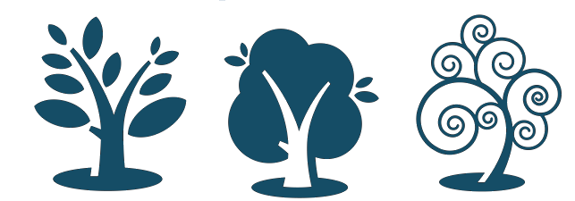
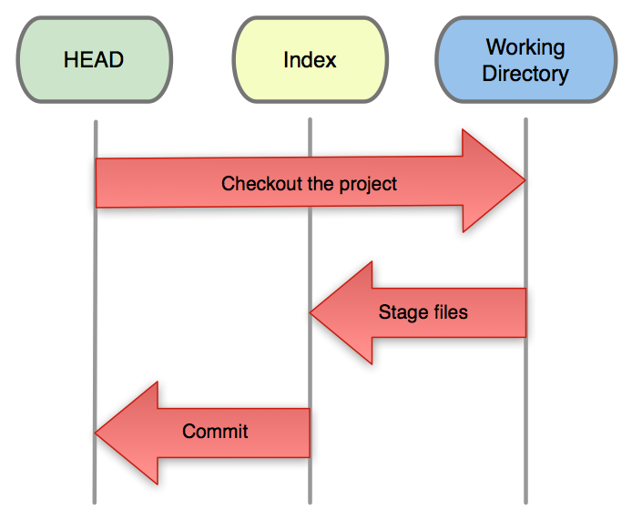

!SLIDE subsec center

# ACT ONE #

## The Three Trees ##

!SLIDE title center

### first tree ###
# the HEAD #

!SLIDE commandline incremental

    $ cat .git/HEAD 
    ref: refs/heads/master

    $ cat .git/refs/heads/master 
    e9a570524b63d2a2b3a7c3325acf5b89bbeb131e

    $ git cat-file -p e9a570524b63d2a2b3a7c3325acf5b89bbeb131e
    tree cfda3bf379e4f8dba8717dee55aab78aef7f4daf
    author Scott Chacon <schacon@gmail.com> 1301511835 -0700
    committer Scott Chacon <schacon@gmail.com> 1301511835 -0700

    initial commit

    $ git ls-tree -r cfda3bf379e4f8dba8717dee55aab78aef7f4daf
    100644 blob a906cb2a4a904a152...   README
    100644 blob 8f94139338f9404f2...   Rakefile
    040000 tree 99f1a6d12cb4b6f19...   lib

!SLIDE title center

### second tree ###
# the index #

!SLIDE

# The Staging Area #

!SLIDE commandline incremental smaller

    $ git ls-files -s
    100644 a906cb2a4a904a152e80877d4088654daad0c859 0	README
    100644 8f94139338f9404f26296befa88755fc2598c289 0	Rakefile
    100644 47c6340d6459e05787f644c2447d2595f5d3a54b 0	lib/simplegit.rb

!SLIDE title center

### third tree ###
# the working directory #

!SLIDE bigcode

    $ tree
    .
    ├── .git
    │   ├── HEAD
    │   ├── [snip]
    │   └── index
    ├── README
    ├── Rakefile
    └── lib
        └── git.rb

!SLIDE subsec center

# Three Trees #
### HEAD, Index and Working Directory ###

!SLIDE center

!SLIDE bullets list incremental

# Tree Roles #

* **HEAD** last commit, next parent
* **Index** proposed next commit
* **Work Dir** sandbox
